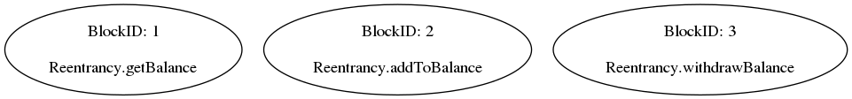
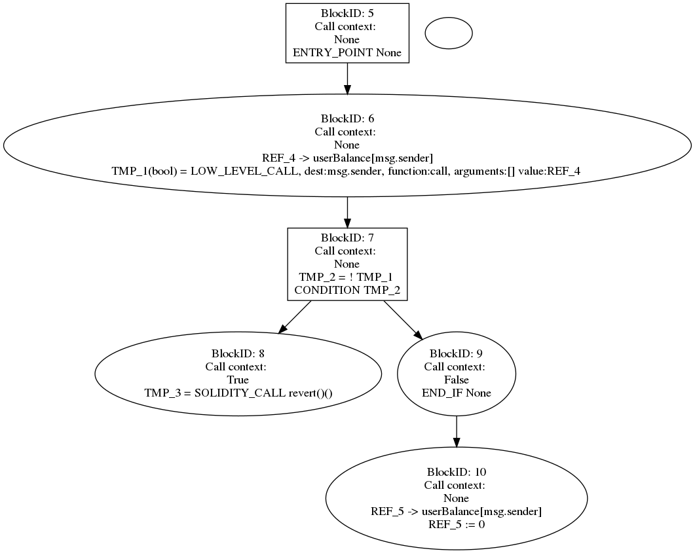
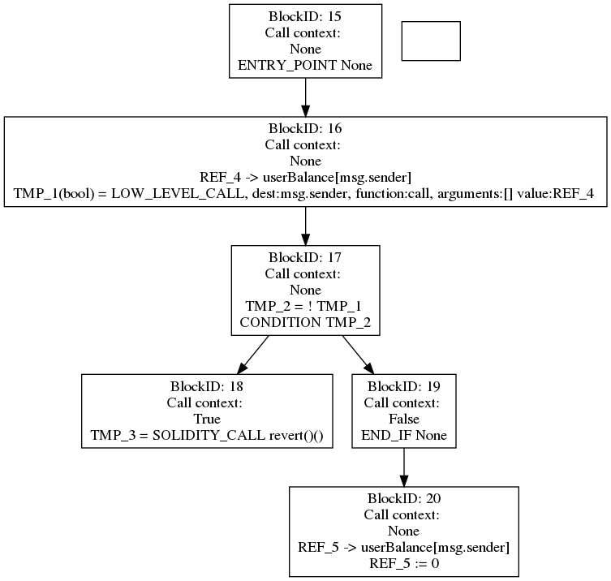
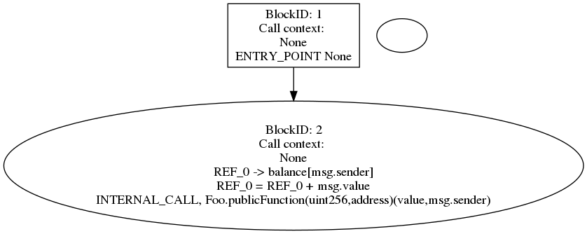
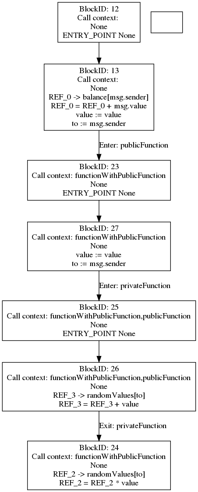
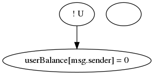
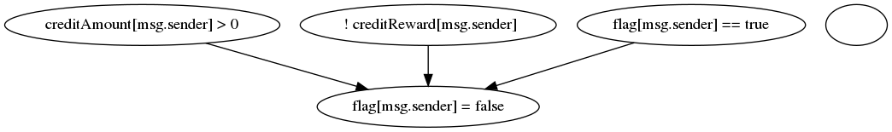
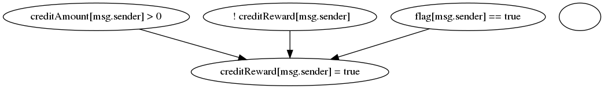
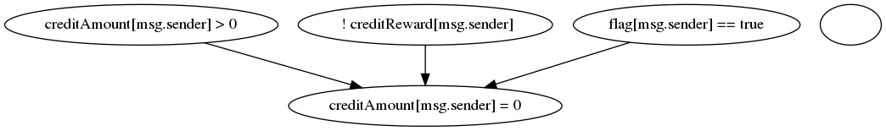
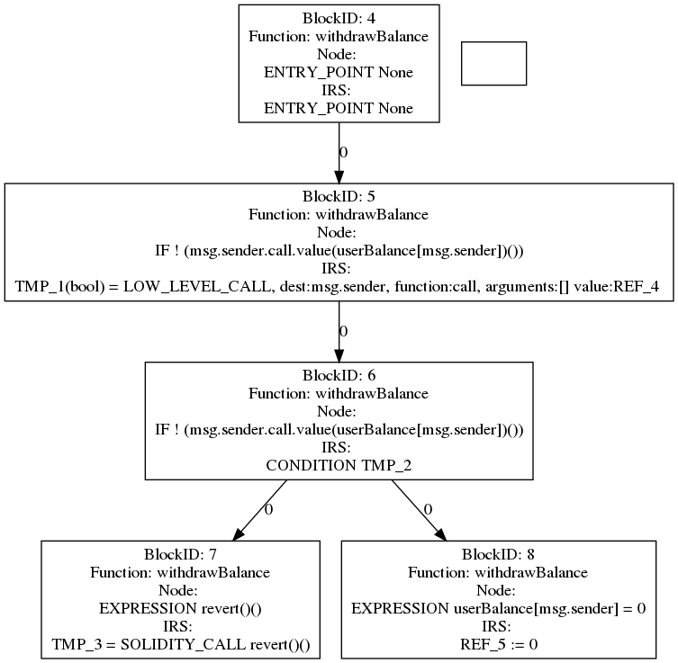

<h1 align="center">SailfishDocumentation</h1>

Все графы будут сгенерированы для следубщего котракта и функции withdrawBalance (если не приведён какой-то другой пример):

pragma solidity ^0.4.24;

contract Reentrancy {
    mapping (address => uint) userBalance;
   
    function getBalance(address u) view public returns(uint){
        return userBalance[u];
    }

    function addToBalance() payable public{
        userBalance[msg.sender] += msg.value;
    }   

    function withdrawBalance() public{
        // send userBalance[msg.sender] ethers to msg.sender
        // if mgs.sender is a contract, it will call its fallback function
        if( ! (msg.sender.call.value(userBalance[msg.sender])() ) ){
            revert();
        }
        userBalance[msg.sender] = 0;
    }   
}

## Начало

Идёт инициализация Slither. Из него берут информацию о функциях и переменных для построения зависимостей.

slither_obj = Slither(contract_path, solc=solc_path)

## Callgraph

Для каждой функции из каждого контракта добавляется вершина для функции в граф. В конце все вершины складываются в общий граф. Рёбер на этом этапе нет, функции на отдельные иструкции не раскладываются. 

(Замечание: есть ещё проверки на interanl и external call для функций, которые так же влияют на граф, но в моём примере эти проверки не прошли)

## generate_icfg

Для начала генерируется граф cfg для каждой функции. На этом этапе функция разбивается на блоки с интсрукциями. 

Далее cfg используется для icfg. В данном примере разницы между ними нет.

Однако, если внурти одной функции есть вызов другой функции контракта (неважно, публичной или приватной), этот вызов разоюбъётся на отдельные блоки. Это можно видеть в данном примере:

pragma solidity ^0.4.21;
contract Foo {
    mapping (address => uint256) public balance;
    mapping (address => uint256) public randomValues;

    
    function functionWithPublicFunction(uint256 value) public payable {
       balance[msg.sender] += msg.value;
       publicFunction(value, msg.sender);
    }

    function functionWithPrivateFunction(uint256 value) public payable {
       balance[msg.sender] += msg.value;
       privateFunction(value, msg.sender);
    }

    function publicFunction(uint256 value, address to) public {
        privateFunction(value, msg.sender);
        randomValues[to] *= value;
    }

    function privateFunction(uint256 value, address to) private {
        randomValues[to] += value;
    }
}

Будут сгенерированы такие cfg и icfg:

## range_graph
Для каждой функии находятся зависимости глобальных переменных. На данном примере условие является вызовом некоторой функции и обозначается как U.

При рассмотрении функции ниже есть 3 условия выполнения блока if и в нём есть 3 изменения глобальных переменных. Для каждого из этого изменения сгенерируется свой range граф:

function withdrawAllBalance() public {
    uint creditBalance = creditAmount[msg.sender];
    
    if (creditBalance > 0 && !creditReward[msg.sender] && flag[msg.sender])
    {
      flag[msg.sender] = false;
      creditReward[msg.sender] = true;
      msg.sender.call.value(creditBalance)("");
      creditAmount[msg.sender] = 0;
    }
  }

## generate_sdg

Для каждой функции создаётся свой sdg

(Замечание: есть ещё некоторые modifiers, но пока они не использовались в примере.)

Для начала функцией build_simplified_icfg(self) генерируется simplified icfg, содержащий базовые блоки, способные менять состояние контракта (в комментариях написано, что учитываются 1, 4, 6).

В начале этой функиции вызывается self.propagate_state_vars_used(), использующий bfs. В этом bfs делаются вызовы

successor._pred_state_var_used.update(basic_block._pred_state_var_used)

successor._pred_state_var_used.update(basic_block._state_vars_used)

Далее для каждого блока icfg упрощаюстя базовые блоки, которые не нужны для протеворечивого состояния.

Если блок пустой и у него есть 2 предка, то этот блок становиться отдельной phi вершиной.

Добавляются рёбра между блоками, если список инструкций не пуст. Так же, если оказывается вершина без предков и потомков, надо убедиться, что вершина добавлена в граф. (конец build\_simplified\_icfg)

Пример сгенерированного sicfg:

Далее функция self.build_sdg(self._contract, self._function, self._sicfg), результат сохраняется в SDG.sdg_generated[self._function]. Эта функция добавляет dataflow edges к IR интсрукциям.

Ход функции:

К графу sicfg прикрепляются глобальные переменные, строятся рёбра к ним. Эти зависимости берутся из range графа. Результат работы:

## Composed

В этом блоке пытаются склеить по 2 функции.

1. Идёт отбрасывание приватных функций и конструкторов.

2. Если в функции имеется external_call, то делаются analyze_call_destination и analyze_lowlevelcall_gas для этой функции.

(Замечание: в этих функциях используется slither)

3. Если функция отпавляет ether или имеет external_call, то для неё создаётся стуктура Compose, которая запоминается в composed_sdg[function].

### Что происходит в Compose

Вызывается метод build_composed_sdg, в котором

a. Среди всех matching_sdg выделяют общие переменные.

b. Получаем вершины инструкций для target sdg, который анализируется на предмет уязвимости

c. При наличии external_call, вызывается self.get_dao_composed_sdg. Результат запоминается в self._dao_composed_sdgs и 

self._dao_composed_sdg_to_call_predecessors

### Что происходит в get_dao_composed_sdg

Создаётся словарь словарей composed_sdgs. Первым ключём является вункция, для которой мы создавали Compose (self._sdg_obj._function), второй ключ -- сопоставляемая ей функция (matching_sdg_obj._function). Значением же является список tuple из 4 элементов -- (composed_sdg, graph_node, modified_sdg, matching_sdg)

Перебираются вершины из target_sdg. Анализ начнётся только если тип инструкции в этой вершине имеет значение LowLevelCall или HighLevelCall!

Если все проверки прошли, то находятся все вершины, которые появляются после external_call. Точно так же и те, что были до него, включая вершину с external_call.

Если функции matching_sdg_obj._function и self._sdg_obj._function совпадают, то надо сделать копию графа.

Далее composed_sdg = nx.compose(modified_sdg, matching_sdg) -- для inlining matching sdg.

self.remove_edges(composed_sdg, [graph_node], successors)

self.add_src_to_dest_edges(composed_sdg, [graph_node], root_nodes, function_start)

self.add_src_to_dest_edges(composed_sdg, leaf_nodes, successors, function_end)

(Ещё немного обработки рёбер)

Пополнение composed_sdgs полученным tuple (composed_sdg, graph_node, modified_sdg, matching_sdg).

После обработки сопоставляемых функций, если установлен флаг _dump_graph, нарисуются соответствующие графы.

## Нахождение уязвимостей в блоке detection

TODO

## Словарик с обозначениями

SDG -- storage dependency graph