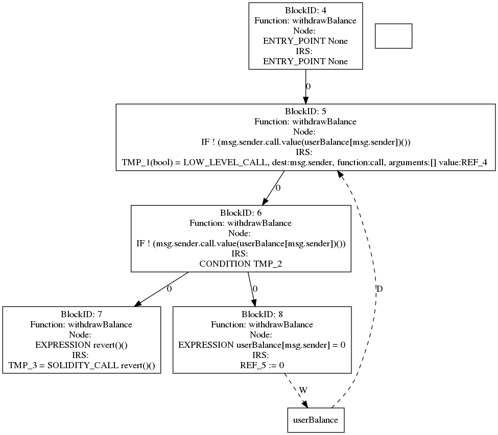

<h1 align="center">SailFish Documentation</h1>

Все графы будут сгенерированы для следующего котракта и функции withdrawBalance (если не приведён какой-то другой пример):

```solidity
pragma solidity ^0.4.24;

contract Reentrancy {
    mapping (address => uint) userBalance;
   
    function getBalance(address u) view public returns(uint){
        return userBalance[u];
    }

    function addToBalance() payable public{
        userBalance[msg.sender] += msg.value;
    }   

    function withdrawBalance() public{
        // send userBalance[msg.sender] ethers to msg.sender
        // if mgs.sender is a contract, it will call its fallback function
        if( ! (msg.sender.call.value(userBalance[msg.sender])() ) ){
            revert();
        }
        userBalance[msg.sender] = 0;
    }   
}
```


## Начало


Идёт инициализация `Slither`. Из него берут информацию о функциях и переменных для построения зависимостей:

```python
slither_obj = Slither(contract_path, solc=solc_path)
```


## Построение *Callgraph* графа


Для каждой функции из каждого контракта в граф `callgraph` добавляется соответствующая этой функции вершина. Рёбер на этом этапе нет, функции на отдельные иструкции не раскладываются. 

***Замечание**: есть ещё проверки на `internal call` и `external call` для функций, которые так же влияют на граф, но в моём примере эти проверки не прошли.*


## Построение *ICFG*


Сначала для каждой функции генерируется ***CFG*** -- Control-Flow Graph -- ориентированный граф в каждой вершине которого находится блок с последовательно выполняющимися инструкциями (без условных переходов) и условием перехода в другие блоки, если таковое есть. Ребра же отражают последовательность выполнения этих блоков (какой блок будет выполнен следующим). Для нашего примера будет построен следующий ***CFG*** :


Далее по каждому ***CFG*** строится соответствующий ***ICFG*** -- *Inter-procedural Control-Flow Graph* -- отличие которого от ***CFG*** заключается в подстановке соответствующих ***CFG*** графов вместо вызовов других функций контракта (неважно, публичной или приватной). При такой подстановке блок с инструкцией разбивается на части. За отсутствием вызовов других функций в нашем примере разницы между построенными ***CFG*** и ***ICFG*** нет:


Однако продемонстрировать разницу графов можно на примере следующего контракта:

```solidity
pragma solidity ^0.4.21;
contract Foo {
    mapping (address => uint256) public balance;
    mapping (address => uint256) public randomValues;

    
    function functionWithPublicFunction(uint256 value) public payable {
       balance[msg.sender] += msg.value;
       publicFunction(value, msg.sender);
    }

    function functionWithPrivateFunction(uint256 value) public payable {
       balance[msg.sender] += msg.value;
       privateFunction(value, msg.sender);
    }

    function publicFunction(uint256 value, address to) public {
        privateFunction(value, msg.sender);
        randomValues[to] *= value;
    }

    function privateFunction(uint256 value, address to) private {
        randomValues[to] += value;
    }
}
```

Для него будут сгенерированы следующие графы:
- ***CFG***:


- ***ICFG***:


## Построение *range* графа


Для каждой функии находятся все внутренние зависимости от глобальных переменных. `SailFish` визуализирует их как ориентированный граф с ребрами от вершин с условиями к вершинам с самими переменными. На нашем примере условие выражается вызовом некоторой функции, обозначенной как `U`:


Так же полезно будет рассмотреть пример следующей функции с $3$-мя внутренними изменениями глобальных переменных:

```solidity
function withdrawAllBalance() public {
    uint creditBalance = creditAmount[msg.sender];
    
    if (creditBalance > 0 && !creditReward[msg.sender] && flag[msg.sender])
    {
      flag[msg.sender] = false;
      creditReward[msg.sender] = true;
      msg.sender.call.value(creditBalance)("");
      creditAmount[msg.sender] = 0;
    }
  }
```

Для каждого из этих изменений сгенерируется свой `range` граф:


## Построение *SDG*


Для каждой функции создаётся свой ***SDG*** -- *Storage Dependency Graph* -- граф, в котором:
- **вершины** -- это либо глобальные переменные, либо блоки операций над этими переменными
- **ребра** -- это отношения между блоками заключающиеся в чтении (*D*), записи (*W*) или порядке исполнения (*O*).

***Замечание**: есть ещё некоторые `modifiers`, но пока они не использовались в примере.*

Для начала функцией `build_simplified_icfg(self)` генерируется ***Simplified ICFG***, содержащий базовые блоки, способные менять состояние контракта (в комментариях написано, что учитываются 1, 4, 6).

В начале этой функции вызывается `self.propagate_state_vars_used()`, использующий алгоритм *bfs*. В этом *bfs* делаются вызовы

```python
successor._pred_state_var_used.update(basic_block._pred_state_var_used)
successor._pred_state_var_used.update(basic_block._state_vars_used)
```

Далее для каждого блока (вершины) из ***ICFG*** упрощаются базовые блоки, которые не нужны для противоречивого состояния.

Если блок пустой и у него есть $2$ предка, то этот блок становиться отдельной $\varphi$-вершиной.

Добавляются рёбра между блоками, если список инструкций не пуст. Так же, если оказывается вершина без предков и потомков, надо убедиться, что вершина добавлена в граф (конец `build_simplified_icfg`).

Пример сгенерированного ***SICFG***:


Далее функция `self.build_sdg(self._contract, self._function, self._sicfg)`, результат сохраняется в `SDG.sdg_generated[self._function]`. Эта функция добавляет *dataflow edges* к `IR` инструкциям.

Ход функции:

К графу ***SICFG*** прикрепляются глобальные переменные, строятся рёбра к ним. Эти зависимости берутся из ***Range*** графа. Результат работы:




## Построение *Compose* графа


В этом модуле пытаются склеить по $2$ функции.

1. Идёт отбрасывание приватных функций и конструкторов.

2. Если в функции имеется `external_call`, то делаются `analyze_call_destination` и `analyze_lowlevelcall_gas` для этой функции.

***Замечание**: в этих функциях используется `Slither`.*

3. Если функция отправляет `ether` или имеет `external_call`, то для неё создаётся стуктура `Compose`, которая запоминается в `composed_sdg[function]`.


### Что происходит в Compose


Вызывается метод `build_composed_sdg`, в котором

a. Среди всех `matching_sdg` выделяют общие переменные.

b. Получаем вершины инструкций для `target_sdg`, который анализируется на предмет уязвимости

c. При наличии `external_call`, вызывается `self.get_dao_composed_sdg`. Результат запоминается в `self._dao_composed_sdgs` и 

`self._dao_composed_sdg_to_call_predecessors`.

### Что происходит в `get_dao_composed_sdg`

Создаётся словарь словарей `composed_sdgs`. Первым ключём является функция, для которой мы создавали `Compose` (`self._sdg_obj._function`), второй ключ -- сопоставляемая ей функция (`matching_sdg_obj._function`). Значением же является *tuple* из 4 элементов -- `(composed_sdg, graph_node, modified_sdg, matching_sdg)`.

Перебираются вершины из `target_sdg`. Анализ начнётся только если тип инструкции в этой вершине имеет значение `LowLevelCall` или `HighLevelCall`.

Если все проверки прошли, то находятся все вершины, которые появляются после `external_call`. Точно так же и те, что были до него, включая вершину с `external_call`.

Если функции `matching_sdg_obj._function` и `self._sdg_obj._function` совпадают, то надо сделать копию графа.

Далее `composed_sdg = nx.compose(modified_sdg, matching_sdg)` -- для вставки `matching_sdg`.

```python
self.remove_edges(composed_sdg, [graph_node], successors)
self.add_src_to_dest_edges(composed_sdg, [graph_node], root_nodes, function_start)
self.add_src_to_dest_edges(composed_sdg, leaf_nodes, successors, function_end)
```

*(Ещё немного обработки рёбер)*

Пополнение `composed_sdgs` полученным *tuple* `(composed_sdg, graph_node, modified_sdg, matching_sdg)`.

После обработки сопоставляемых функций, если установлен флаг `_dump_graph`, нарисуются соответствующие графы.

## Нахождение уязвимостей в блоке `detection`

TODO
